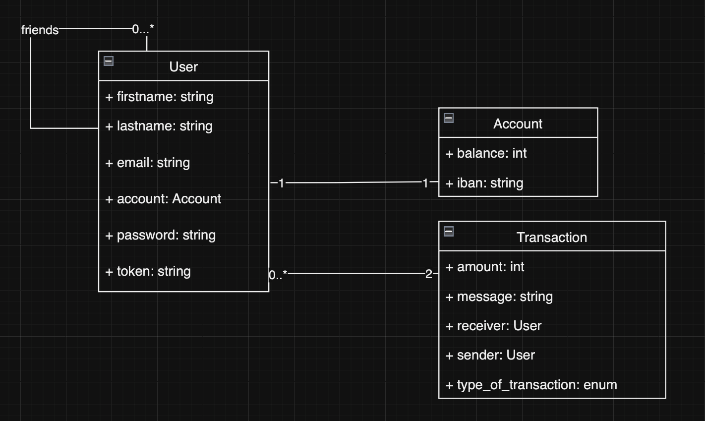
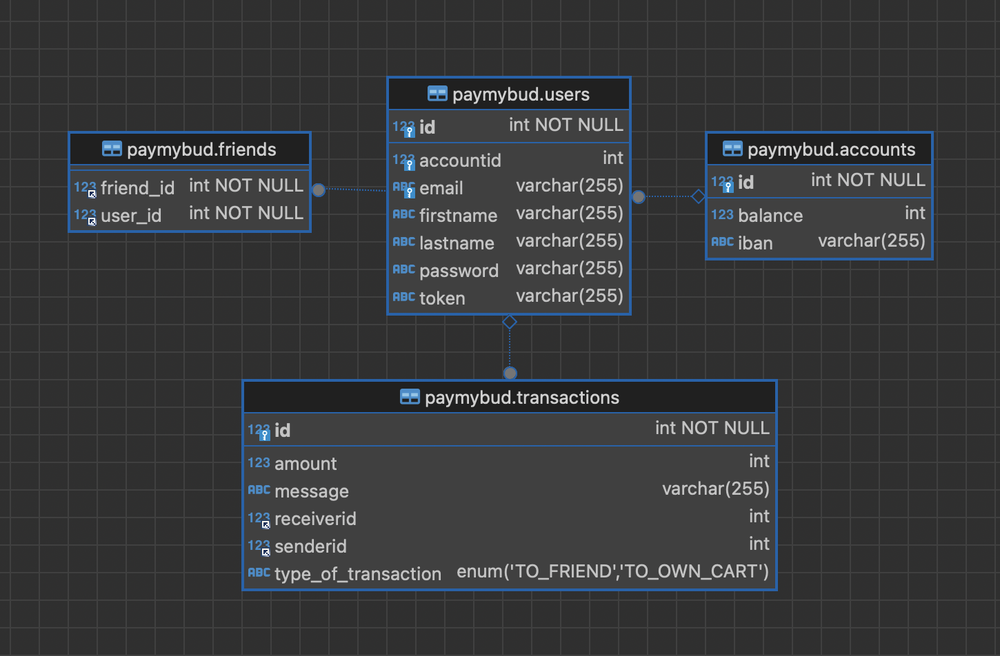

# Pay My Buddy :

Creating Java application from scratch

Pay My Buddy is web application that allows yoy to send and receive money through your 
linked bank account. In addition, you can transfer your money to your linked bank account.
payments between friends.


-------------------------------------------------------------------------------------------------------------------------------------

## Requirement :

- Java 17.0.6
- Apache Maven 3.9.4
- Spring Boot 3.1.4
- Maven dependencies : (Lombok / Spring Web / Spring Data JPA / Spring Security + java 
  JWT / Jacoco )

-------------------------------------------------------------------------------------------------------------------------------------

## Installation :

-  Maven
-  Java
-  MySQL

## Getting Started :

- Clone or download
```bash
git clone git@github.com:JamaaSar/paymybud.git
```
- Use Maven to build application  
```bash
mvn clean install
```


-------------------------------------------------------------------------------------------------------------------------------------

## Class Diagram :



-------------------------------------------------------------------------------------------------------------------------------------

## Data Model :



-------------------------------------------------------------------------------------------------------------------------------------
